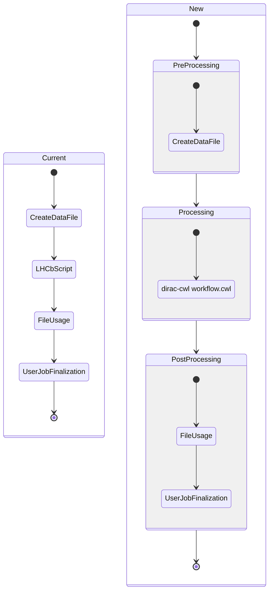
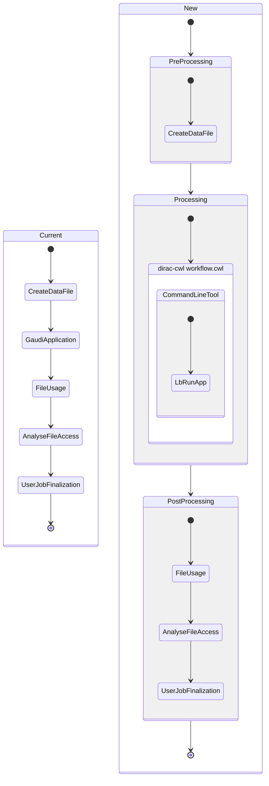
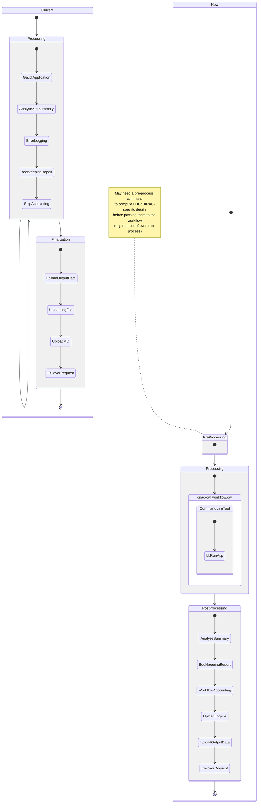
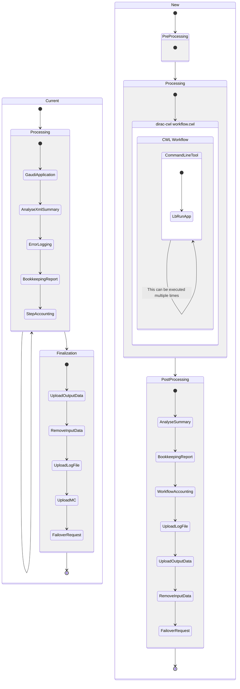

# LHCb Workflow Commands

This document describes how LHCb workflows are migrated from the old DIRAC XML workflow system to dirac-cwl with CWL. It serves two purposes:

1. **For the LHCb team**: a reference for performing the migration, explaining what each module becomes, how commands communicate, and the phased migration plan.
2. **For other communities**: an example of how to design pre/post-processing commands for their own experiment's workflows using dirac-cwl.

## Architecture Overview

### Why we are migrating

Currently, LHCb workflow modules (`LHCbDIRAC/Workflow/Modules`) are the workflow: they call LHCb applications **and** LHCbDIRAC-specific logic (bookkeeping, accounting, file uploads) in the same execution context. This means the workflow cannot run on resources with no external connectivity, which is a growing requirement.

The new approach separates concerns:

- **Pre-process commands** — LHCbDIRAC-specific setup that requires external connectivity (runs before the workflow)
- **CWL workflow** — Pure LHCb application logic via `lb-prod-run` (no external connectivity required)
- **Post-process commands** — LHCbDIRAC-specific reporting, upload, and cleanup (runs after the workflow)

### Job wrapper lifecycle

The dirac-cwl job wrapper manages the full job lifecycle. Some steps are **generic** (provided by dirac-cwl, always run, not configurable by experiments) and some are **experiment-specific** (configured per job type):

```
Job Wrapper (generic dirac-cwl)
│
├── [setup]  — always runs before everything (generic)
│   ├── Download input sandbox
│   ├── Download input data
│   └── Resolve file catalog
│
├── Pre-process commands (experiment-specific, sequential)
│
├── CWL workflow execution (experiment-specific)
│
├── Post-process commands (experiment-specific, sequential)
│
└── [finally] — always runs, even on crash (generic)
    ├── Upload logs (target SE configured by experiment)
    ├── Commit input file statuses (Processed/Unused) if managed by a transformation
    ├── Commit accounting records (from accounting/*.json)
    ├── Merge failover operations + write request.json
    └── Report final job status
```

The `setup` and `finally` blocks are **not configurable by experiments**. They always run. This guarantees that:
- Logs are always uploaded (even on crash — critical for debugging). The log upload mechanism is generic, but the target SE and log path are configured by the experiment.
- For production jobs managed by the Transformation System, input files are marked as "Processed" or "Unused" so they don't get stuck as "Assigned" (no-op for user jobs)
- Failover operations are always serialized for the RequestDB
- Accounting records are committed. The commit mechanism is generic DIRAC, but the *content* of the records (which fields, which accounting types) is experiment-specific — the `finally` block commits whatever accounting JSON files the experiment's commands have written.

### How commands communicate

In the old system, modules share data through **mutable in-memory objects** (`workflow_commons`, `step_commons`). This makes modules tightly coupled and hard to test in isolation.

In the new system, commands communicate through **files on disk** under `job_path/`. Each command reads from well-known paths and writes to well-known paths:

| Purpose | File path | Writer | Reader |
|---|---|---|---|
| File statuses | `reports/file_statuses.json` | AnalyseSummary | job wrapper (`finally`) |
| Bookkeeping records | `bookkeeping/bookkeeping_*.xml` | BookkeepingReport | UploadOutputData |
| Accounting records | `accounting/*.json` | WorkflowAccounting | job wrapper (`finally`) |
| Failover operations | `failover/*.json` | Upload commands | job wrapper (`finally`) |
| Output manifest | `outputs/manifest.json` | ConstructLFNs | Upload commands |

This makes dependencies explicit, commands independently testable, and eliminates shared mutable state.

### What's generic vs experiment-specific

| Provided by dirac-cwl (generic) | Implemented by each experiment |
|---|---|
| Job wrapper lifecycle (setup/finally) | Pre-process commands (e.g. ComputeEvents) |
| Log upload mechanism (target SE configured by experiment) | Post-process commands (e.g. BookkeepingReport) |
| File status management | CWL workflow definitions |
| Failover request handling | LFN construction scheme |
| Accounting commit mechanism (record content is experiment-specific) | Metadata/catalog integration |
| Upload to SE with failover | Application-specific validation |
| Phased command execution | |

Other communities (e.g. CTAO) would implement their own pre/post-process commands but reuse the entire job wrapper infrastructure, upload utilities, and execution model.

## Types of workflows

For the new LHCb Workflows approach with CWL, the modules are called "commands" and the order of execution of the commands has to be defined while creating the `JobType`, which can be the same as the current order.

Every `JobType` has to define certain pre-processing and post-processing steps containing a list of commands. That list can be empty and will always execute in the same order.

A few modules have been removed, as they are no longer needed (see [Removed commands](#removed-commands)).

### USER Job (setExecutable)



### USER Job (setApplication)



### Simulation Job

For this type of job and for the following one (Reconstruction), currently we have some kind of processing and a post-processing (Finalization) step. The main difference with the new approach is that the old processing step also contained modules. As this step could be executed multiple times, so did those modules.

Now, the corresponding commands got moved out of the processing step, which forces them to deal with multiple outputs at a time, as they only execute once.



> **Note:** Commands such as `AnalyseSummary`, `BookkeepingReport`, and `WorkflowAccounting` (formerly `StepAccounting`) currently run once per step inside the processing loop. In the new approach, they run **once** after the entire CWL workflow completes, processing all step outputs at once. This is a behavioral change that requires adapting these commands to handle multiple outputs.

### Reconstruction Job



## Relations between commands and DIRAC Components

```mermaid
---
title: Dirac-CWL commands
config:
    flowchart:
        defaultRenderer: "elk"
        curve: linear
---
flowchart LR
    %% ======================
    %% DataManager
    %% ======================

    DataManager[DataManager]

    %% Functions

    getDestinationSEList{{getDestinationSEList}}
    getDestinationSEList getDestinationSEList_l@===> DataManager

    getFileDescendants{{"getFileDescendants (lhcb)"}}
    getFileDescendants getFileDescendants_l@===> DataManager

    removeFile{{removeFile}}
    removeFile removeFile_l@===> DataManager

    getSiteSEMapping{{getSiteSEMapping}}
    getSiteSEMapping getSiteSEMapping_l@===> DataManager

    %% Styling

    classDef DataManagerLink stroke:#C00707
    classDef DataManagerNode fill:#FF4400,stroke:#C00707,stroke-width:4px,color:black,font-weight:bold ;

    class DataManager,getDestinationSEList,getFileDescendants,removeFile,getSiteSEMapping DataManagerNode
    class getDestinationSEList_l,getFileDescendants_l,removeFile_l,getSiteSEMapping_l DataManagerLink

    %% ======================
    %% OpsHelper
    %% ======================

    OpsHelper[OpsHelper]

    %% Functions

    getValue{{getValue}}
    getValue getValue_opsHelper_l@===> OpsHelper

    %% Styling

    classDef OpsHelperLink stroke:#A35F00
    classDef OpsHelperNode fill:#FFA82E,stroke:#A35F00,stroke-width:4px,color:black,font-weight:bold ;

    class getValue,OpsHelper OpsHelperNode
    class getValue_opsHelper_l OpsHelperLink

    %% ======================
    %% StorageElement
    %% ======================

    StorageElement[StorageElement]

    %% Functions

    getUrl{{getUrl}}
    getUrl getUrl_l@===> StorageElement

    putFile{{putFile}}
    putFile putFile_l@===> StorageElement

    %% Styling

    classDef StorageElementLink stroke:#FFA240 ;
    classDef StorageElementNode fill:#FFD41D,stroke:#FFA240,stroke-width:4px,color:black,font-weight:bold ;

    class getUrl,putFile,StorageElement StorageElementNode
    class getUrl_l,putFile_l StorageElementLink

    %% ======================
    %% DataStoreClient
    %% ======================

    DataStoreClient[DataStoreClient]

    %% Functions

    addRegister{{addRegister}}
    addRegister addRegister_l@===> DataStoreClient

    %% Styling

    classDef DataStoreClientLink stroke:#BBC863 ;
    classDef DataStoreClientNode fill:#F0E491,stroke:#BBC863,stroke-width:4px,color:black,font-weight:bold ;

    class addRegister,DataStoreClient DataStoreClientNode
    class addRegister_l DataStoreClientLink

    %% ======================
    %% FailoverTransfer
    %% ======================

    FailoverTransfer[FailoverTransfer]

    %% Functions

    transferAndRegisterFile{{transferAndRegisterFile}}
    transferAndRegisterFile transferAndRegisterFile_l@===> FailoverTransfer

    setFileReplicationRequest{{_setFileReplicationRequest}}
    setFileReplicationRequest setFileReplicationRequest_l@===> FailoverTransfer

    %% Styling

    classDef FailoverTransferLink stroke:#237227 ;
    classDef FailoverTransferNode fill:#519A66,stroke:#237227,stroke-width:4px,color:black,font-weight:bold ;

    class transferAndRegisterFile,setFileReplicationRequest,FailoverTransfer FailoverTransferNode
    class transferAndRegisterFile_l,setFileReplicationRequest_l FailoverTransferLink

    %% ======================
    %% JobReport
    %% ======================

    JobReport[JobReport]

    %% Functions

    setJobParameter{{setJobParameter}}
    setJobParameter setJobParameter_l@===> JobReport

    setApplicationStatus{{setApplicationStatus}}
    setApplicationStatus setApplicationStatus_l@===> JobReport

    %% Styling

    classDef JobReportLink stroke:#9AB17A ;
    classDef JobReportNode fill:#C3CC9B,stroke:#9AB17A,stroke-width:4px,color:black,font-weight:bold ;

    class setJobParameter,setApplicationStatus,JobReport JobReportNode
    class setJobParameter_l,setApplicationStatus_l JobReportLink

    %% ======================
    %% BookkeepingClient
    %% ======================

    BookkeepingClient[BookkeepingClient]

    %% Functions

    getFileMetadata{{getFileMetadata}}
    getFileMetadata getFileMetadata_l@===> BookkeepingClient

    sendXMLBookkeepingReport{{sendXMLBookkeepingReport}}
    sendXMLBookkeepingReport sendXMLBookkeepingReport_l@===> BookkeepingClient

    getFileTypes{{"getFileTypes (lhcb)"}}
    getFileTypes getFileTypes_l@===> BookkeepingClient

    %% Styling

    classDef BookkeepingClientLink stroke:#81A6C6 ;
    classDef BookkeepingClientNode fill:#AACDDC,stroke:#81A6C6,stroke-width:4px,color:black,font-weight:bold ;

    class getFileMetadata,sendXMLBookkeepingReport,getFileTypes,BookkeepingClient BookkeepingClientNode
    class getFileMetadata_l,sendXMLBookkeepingReport_l,getFileTypes_l BookkeepingClientLink

    %% ======================
    %% FileReport
    %% ======================

    FileReport[FileReport]

    %% Functions

    getFiles{{getFiles}}
    getFiles getFiles_l@===> FileReport

    setFileStatus{{setFileStatus}}
    setFileStatus setFileStatus_l@===> FileReport

    commit{{commit}}
    commit commit_l@===> FileReport

    generateForwardDISET{{generateForwardDISET}}
    generateForwardDISET generateForwardDISET_l@===> FileReport

    %% Styling

    classDef FileReportLink stroke:#FE81D4 ;
    classDef FileReportNode fill:#FAACBF,stroke:#FE81D4,stroke-width:4px,color:black,font-weight:bold ;

    class getFiles,setFileStatus,commit,generateForwardDISET,FileReport FileReportNode
    class getFiles_l,setFileStatus_l,commit_l,generateForwardDISET_l FileReportLink

    %% ======================
    %% ConfigurationSystem
    %% ======================

    ConfigurationSystem[ConfigurationSystem]

    %% Functions

    getValueGconf{{getValue}}
    getValueGconf getValue_Gconf_l@===> ConfigurationSystem

    %% Styling

    classDef ConfigurationSystemLink stroke:#0B2D72 ;
    classDef ConfigurationSystemNode fill:#0992C2,stroke:#0B2D72,stroke-width:4px,color:black,font-weight:bold ;

    class getValueGconf,ConfigurationSystem ConfigurationSystemNode
    class getValue_Gconf_l ConfigurationSystemLink

    %% ======================
    %% FileCatalog
    %% ======================

    FileCatalog[FileCatalog]

    %% Functions

    addFile{{addFile}}
    addFile addFile_l@===> FileCatalog

    %% Styling

    classDef FileCatalogLink stroke:#4400A3 ;
    classDef FileCatalogNode fill:#A05CFF,stroke:#4400A3,stroke-width:4px,color:black,font-weight:bold ;

    class addFile,FileCatalog FileCatalogNode
    class addFile_l FileCatalogLink

    %% ======================
    %% DataUsage
    %% ======================

    DataUsageClient[DataUsageClient]

    %% Functions

    sendDataUsageReport{{sendDataUsageReport}}
    sendDataUsageReport sendDataUsageReport_l@===> DataUsageClient

    %% Styling

    classDef DataUsageClientLink stroke:#A98B76 ;
    classDef DataUsageClientNode fill:#BFA28C,stroke:#A98B76,stroke-width:4px,color:black,font-weight:bold ;

    class sendDataUsageReport,DataUsageClient DataUsageClientNode
    class sendDataUsageReport_l DataUsageClientLink

    %% ======================
    %% Commands
    %% ======================

    UploadLogFile("UploadLogFile")

    UploadLogFile UploadLogFile_l1@===> getDestinationSEList
    UploadLogFile UploadLogFile_l2@===> getValue
    UploadLogFile UploadLogFile_l3@===> getUrl
    UploadLogFile UploadLogFile_l4@===> putFile
    UploadLogFile UploadLogFile_l5@===> transferAndRegisterFile
    UploadLogFile UploadLogFile_l6@===> setJobParameter
    UploadLogFile UploadLogFile_l7@===> setApplicationStatus
    UploadLogFile UploadLogFile_l8@===> getFileTypes

    class UploadLogFile_l1 DataManagerLink
    class UploadLogFile_l2 OpsHelperLink
    class UploadLogFile_l3,UploadLogFile_l4 StorageElementLink
    class UploadLogFile_l5 FailoverTransferLink
    class UploadLogFile_l6,UploadLogFile_l7 JobReportLink
    class UploadLogFile_l8 BookkeepingClientLink

    %% ======================

    UploadOutputData("UploadOutputData")

    UploadOutputData UploadOutputData_l1@===> transferAndRegisterFile
    UploadOutputData UploadOutputData_l2@===> setJobParameter
    UploadOutputData UploadOutputData_l3@===> setApplicationStatus
    UploadOutputData UploadOutputData_l4@===> sendXMLBookkeepingReport
    UploadOutputData UploadOutputData_l5@===> addFile
    UploadOutputData UploadOutputData_l6@===> getFileDescendants
    UploadOutputData UploadOutputData_l7@===> getSiteSEMapping
    UploadOutputData UploadOutputData_l8@===> getDestinationSEList

    class UploadOutputData_l1 FailoverTransferLink
    class UploadOutputData_l2,UploadOutputData_l3 JobReportLink
    class UploadOutputData_l4 BookkeepingClientLink
    class UploadOutputData_l5 FileCatalogLink
    class UploadOutputData_l6,UploadOutputData_l7,UploadOutputData_l8 DataManagerLink

    %% ======================

    RemoveInputData("RemoveInputData")

    RemoveInputData RemoveInputData_l1@===> removeFile
    RemoveInputData RemoveInputData_l2@===> setApplicationStatus

    class RemoveInputData_l1 DataManagerLink
    class RemoveInputData_l2 JobReportLink

    %% ======================

    FailoverRequest("FailoverRequest")

    FailoverRequest FailoverRequest_l1@===> getFiles
    FailoverRequest FailoverRequest_l2@===> setFileStatus
    FailoverRequest FailoverRequest_l3@===> generateForwardDISET
    FailoverRequest FailoverRequest_l4@===> commit

    class FailoverRequest_l1,FailoverRequest_l2,FailoverRequest_l3,FailoverRequest_l4 FileReportLink

    %% ======================

    BookkeepingReport("BookkeepingReport")

    BookkeepingReport BookkeepingReport_l1@===> setApplicationStatus
    BookkeepingReport BookkeepingReport_l2@===> getFileMetadata
    BookkeepingReport BookkeepingReport_l3@===> getValueGconf

    class BookkeepingReport_l1 JobReportLink
    class BookkeepingReport_l2 BookkeepingClientLink
    class BookkeepingReport_l3 ConfigurationSystemLink

    %% ======================

    WorkflowAccounting("WorkflowAccounting
    (StepAccounting)")

    WorkflowAccounting WorkflowAccounting_l1@===> addRegister
    WorkflowAccounting WorkflowAccounting_l2@===> getValueGconf

    class WorkflowAccounting_l1 DataStoreClientLink
    class WorkflowAccounting_l2 ConfigurationSystemLink

    %% ======================

    AnalyseFileAccess("AnalyseFileAccess")

    AnalyseFileAccess AnalyseFileAccess_l1@===> addRegister

    class AnalyseFileAccess_l1 DataStoreClientLink

    %% ======================

    UserJobFinalization("UserJobFinalization")

    UserJobFinalization UserJobFinalization_l1@===> transferAndRegisterFile
    UserJobFinalization UserJobFinalization_l2@===> setFileReplicationRequest
    UserJobFinalization UserJobFinalization_l3@===> setJobParameter
    UserJobFinalization UserJobFinalization_l4@===> setApplicationStatus

    class UserJobFinalization_l1,UserJobFinalization_l2 FailoverTransferLink
    class UserJobFinalization_l3,UserJobFinalization_l4 JobReportLink

    %% ======================

    FileUsage("FileUsage")

    FileUsage FileUsage_l1@===> getValueGconf
    FileUsage FileUsage_l2@===> sendDataUsageReport

    class FileUsage_l1 ConfigurationSystemLink
    class FileUsage_l2 DataUsageClientLink

    %% ======================

    AnalyseSummary("AnalyseSummary")

    AnalyseSummary AnalyseSummary_l1@===> getFileTypes
    AnalyseSummary AnalyseSummary_l2@===> setApplicationStatus
    AnalyseSummary AnalyseSummary_l3@===> setFileStatus

    class AnalyseSummary_l1 BookkeepingClientLink
    class AnalyseSummary_l2 JobReportLink
    class AnalyseSummary_l3 FileReportLink

```



## Command's inputs & outputs

Some commands have been removed, such as `UploadMC` or `ErrorLogging`, so they won't appear in this table.

| Command | Consumes | Creates | Requires |
| --- | --- | --- | --- |
| CreateDataFile | Inputs | data.py | poolXMLCatName |
| AnalyseSummary | XMLSummary.xml | N/A | ProdId ApplicationName |
| BookkeepingReport | Outputs | bookkeeping_*.xml | StepID ApplicationName ApplicationVersion StartTime ProductionId StepNumber SiteName JobType |
| WorkflowAccounting | N/A | N/A | RunNumber ProdID EventType SiteName ProcessingStep CpuTime NormCpuTime InputsStats OutputStats InputEvents OutputEvents EventTime NProcs JobGroup FinalState |
| FileUsage | Inputs (directory list) | N/A | SiteName |
| AnalyseFileAccess | XMLSummary.xml pool_xml_catalog.xml | N/A | N/A |
| UploadOutputData | Outputs Inputs XMLSummary.xml bookkeeping_*.xml | N/A | OutputDataStep OutputList OutputMode ProductionOutputData SiteName |
| UploadLogFile | Log files | N/A | JobID ProductionID Namespace ConfigVersion |
| UserJobFinalization | UserOutputData | N/A | JobId UserOutputSE SiteName UserOutputPath ReplicateUserOutData UserOutputLFNPrep |
| RemoveInputData | Inputs | N/A | N/A |
| FailoverRequest | Inputs | request.json | N/A |

Legend:

- Consumes: Files that will be processed
- Creates: Files that generates
- Requires: Extra information required from the parameters or DIRAC

### CreateDataFile

Creates a `data.py` data file from the inputs to be used by Ganga.

### AnalyseSummary

Performs a series of checks on the XMLSummary output to make sure the execution was done correctly.

### BookkeepingReport

Generates a bookkeeping report file based on the XMLSummary and the pool XML catalog.

### WorkflowAccounting

Prepare and send accounting information to the DIRAC Accounting system.

### FileUsage

Report file usage to a DataFileUsage service.

### UploadOutputData

Registers every output generated to the corresponding SE and to the Master Catalog or to the FailoverSE in case of failure.

### FailoverRequest

Commits the status of the files in the file report. The status will be "Processed" if everything ended properly or "Unused" if it did not.

### UploadLogFile

Compresses and uploads log files to a Storage Element configured for log storage (LHCb uses an SE called `LogSE`, configured via `Operations/LogStorage/LogSE`).

### UserJobFinalization

Uploads user-specified output files to configured Storage Elements with failover support and optional replication to a secondary site.

### RemoveInputData

Removes the inputs and their replicas (if any) from every SE and File Catalog.

### AnalyseFileAccess

Uses the XMLCatalog and XMLSummary to check if the access of each input file was successful or not.

### Removed commands

- **ErrorLogging** — Deprecated no-op module (just logs and returns success). Not carried forward.
- **UploadMC** — Uploaded MC statistics (errors, XML summaries, generator logs, prmon metrics) to ElasticSearch. To be handled outside the workflow by a dedicated monitoring service.
- **LHCbScript** — Set `CMTCONFIG` environment variable and ran user scripts. In the new model, the CWL CommandLineTool definition handles environment setup, so this module is absorbed into CWL configuration.
- **StepAccounting** — Renamed to **WorkflowAccounting** because it now processes all step outputs at once rather than running per-step.

### Key design decisions

**Why did `AnalyseSummary`, `BookkeepingReport`, and `WorkflowAccounting` move out of the processing loop?**

In the old system, these ran once per Gaudi application step (inside the processing loop). In the new system, `lb-prod-run` already checks the XML Summary and fails fast via exit code, so the CWL workflow stops on step failure without needing experiment-specific logic. The detailed post-execution analysis (marking files as "Problematic", generating BK records, sending accounting) only needs to happen once after the entire workflow completes. This means these commands must be adapted to handle N step outputs at once instead of 1.

**Why do we need pre-process commands?**

Some logic currently embedded in `GaudiApplication` / `RunApplication` requires external connectivity (DIRAC config, CPU time queries) and must run before the CWL workflow, which may execute without external connectivity. For example, computing the number of events to produce in a Simulation job (`getEventsToProduce`) needs the worker node's CPU normalization factor.

**Why move `FailoverRequest` and `UploadLogFile` to the job wrapper?**

These must always execute regardless of whether commands succeed or fail. Today they run "by convention" as the last modules in the chain, but if an earlier module crashes, they may never execute — leaving input files stuck as "Assigned" and logs lost. Moving them to the job wrapper's `finally` block guarantees execution.

## Migration Strategy

The migration from LHCbDIRAC XML workflows to dirac-cwl with CWL happens in three phases. This allows incremental validation without disrupting production.

### Phase 1: Refactor modules into commands

The existing LHCbDIRAC workflow modules (`LHCbDIRAC/Workflow/Modules`) are refactored so that their core logic is extracted into reusable functions that can be called both from the old modules and from new dirac-cwl pre/post-processing commands.

For each module:
1. Extract the business logic into standalone functions (no dependency on `ModuleBase`, `workflow_commons`, or `step_commons`).
2. The old module becomes a thin wrapper that reads from `workflow_commons`/`step_commons`, calls the extracted function, and writes back to the shared state.
3. The new dirac-cwl command becomes a thin wrapper that reads from files on disk, calls the same extracted function, and writes results to files on disk.

This means both the old XML workflow path and the new CWL path share the same underlying logic during the transition. Bugs fixed in one are fixed in both.

```
Before:                          After:

Module (old path)                Module (old path)
├── reads workflow_commons       ├── reads workflow_commons
├── business logic          →    ├── calls shared_logic()
└── writes workflow_commons      └── writes workflow_commons

                                 Command (new path)
                                 ├── reads files from disk
                                 ├── calls shared_logic()
                                 └── writes files to disk
```

### Phase 2: Submit CWL workflows alongside old workflows

Once the commands are functional and tested, start submitting CWL workflows through dirac-cwl for selected job types (e.g., start with USER jobs, then Simulation).

During this phase:
- Old XML workflows and new CWL workflows coexist in production.
- The same transformations can be configured to use either path.
- Validation compares outputs from both paths to ensure correctness.
- The old modules still call into the shared logic, so any production fix applies to both.

### Phase 3: Drop old modules, adapt commands to DiracX

Once old XML workflows are no longer in use:
1. Remove the old LHCbDIRAC workflow modules entirely.
2. Remove the `ModuleBase` infrastructure (`workflow_commons`, `step_commons`, shared mutable objects).
3. Adapt the commands to call DiracX services directly instead of going through old LHCbDIRAC clients (e.g., BookkeepingClient, DataManager).
4. The shared logic functions are updated to use DiracX APIs.

At this point, LHCbDIRAC module code is fully retired, and the commands are self-contained within the dirac-cwl ecosystem using DiracX for all external service calls.

### For other communities

If you are migrating a different experiment's workflows to dirac-cwl, the LHCb migration above serves as a template. The key steps are the same:

1. **Identify your modules.** What logic runs today as part of your workflow that requires external connectivity? That logic becomes pre/post-process commands.
2. **Separate application logic from infrastructure logic.** Your CWL workflow should only contain the experiment's application (no DIRAC calls). Everything else goes into commands.
3. **Design your file-based data flow.** Decide what files each command reads and writes. Use the table in [How commands communicate](#how-commands-communicate) as a starting point.
4. **Implement commands.** Use dirac-cwl's `PreProcessCommand` and `PostProcessCommand` base classes. Each command receives the `job_path` and reads/writes files under it.

What you get for free from dirac-cwl:
- The job wrapper lifecycle (`setup` / `finally`)
- Log upload, file status management, accounting commit, failover request handling
- Upload to Storage Elements with failover (`FailoverTransfer`)
- CWL workflow execution via `cwltool`

What you must implement:
- Pre/post-process commands specific to your experiment's metadata, catalogs, and reporting
- Your LFN naming scheme (equivalent to LHCb's `constructProductionLFNs`)
- Your CWL workflow definitions
