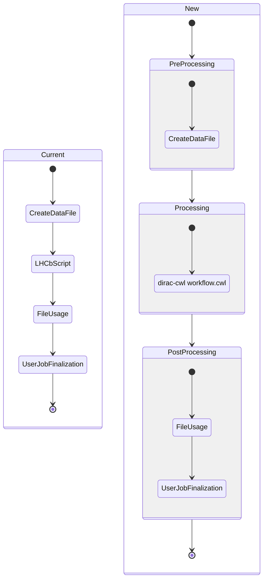
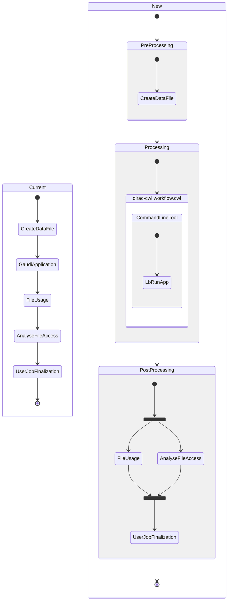
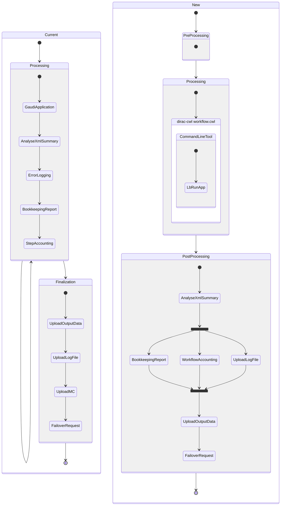
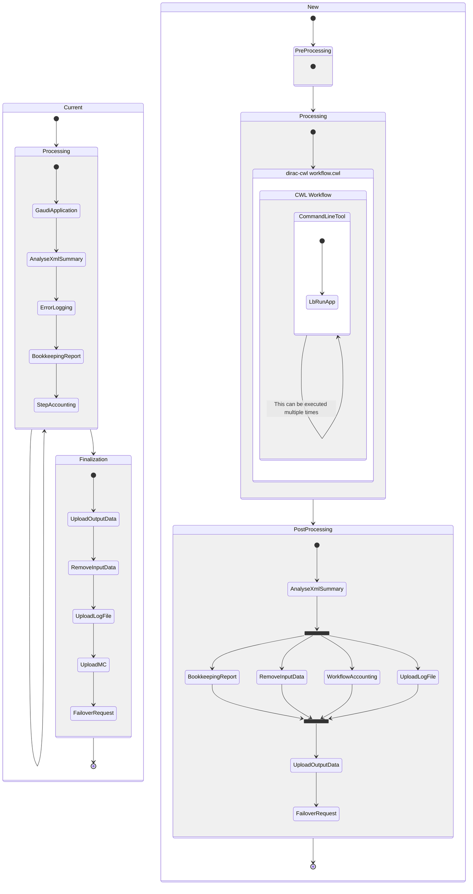

# LHCb Workflow Commands

## Types of workflows

For the new LHCb Workflows approach with CWL, the modules are called "commands" and the order of execution of the commands has to be defined while creating the `JobType`, which can be the same as the current order.

Every `JobType` has to define certain pre-processing and post-processing steps containing a list of command. That list can be empty and will always execute in the same order. However, certain commands could be executed simultaneously. This is shown with a fork in the state diagrams, even though we don't have any plans to implement this feature at this time.

Also a few modules have been removed, as they are no longer needed.

### USER Job (setExecutable)

### USER Job (setApplication)

### Simulation Job

For this type of job and for the following one (Reconstruction), currently we have some kind of processing and a post-processing (Finalization) step. The main difference with the new approach is that the old processing step also contained modules. As this step could be executed multiple times, so did those modules.

Now, the corresponding commands got moved out of the processing step, which forces them to deal with multiple outputs at a time, as they only execute once.

### Reconstruction Job

## Relations between commands and DIRAC Components

```mermaid
---
title: Dirac-CWL commands
config:
    flowchart:
        defaultRenderer: "elk"
        curve: linear
---
flowchart LR
    %% ======================
    %% DataManager
    %% ======================

    DataManager[DataManager]

    %% Functions

    getDestinationSEList{{getDestinationSEList}}
    getDestinationSEList getDestinationSEList_l@===> DataManager

    getFileDescendants{{"getFileDescendants (lhcb)"}}
    getFileDescendants getFileDescendants_l@===> DataManager

    removeFile{{removeFile}}
    removeFile removeFile_l@===> DataManager

    getSiteSEMapping{{getSiteSEMapping}}
    getSiteSEMapping getSiteSEMapping_l@===> DataManager

    %% Styling

    classDef DataManagerLink stroke:#C00707
    classDef DataManagerNode fill:#FF4400,stroke:#C00707,stroke-width:4px,color:black,font-weight:bold ;

    class DataManager,getDestinationSEList,getFileDescendants,removeFile,getSiteSEMapping DataManagerNode
    class getDestinationSEList_l,getFileDescendants_l,removeFile_l,getSiteSEMapping_l DataManagerLink

    %% ======================
    %% OpsHelper
    %% ======================

    OpsHelper[OpsHelper]

    %% Functions

    getValue{{getValue}}
    getValue getValue_opsHelper_l@===> OpsHelper

    %% Styling

    classDef OpsHelperLink stroke:#A35F00
    classDef OpsHelperNode fill:#FFA82E,stroke:#A35F00,stroke-width:4px,color:black,font-weight:bold ;

    class getValue,OpsHelper OpsHelperNode
    class getValue_opsHelper_l OpsHelperLink

    %% ======================
    %% StorageElement
    %% ======================

    StorageElement[StorageElement]

    %% Functions

    getUrl{{getUrl}}
    getUrl getUrl_l@===> StorageElement

    putFile{{putFile}}
    putFile putFile_l@===> StorageElement

    %% Styling

    classDef StorageElementLink stroke:#FFA240 ;
    classDef StorageElementNode fill:#FFD41D,stroke:#FFA240,stroke-width:4px,color:black,font-weight:bold ;

    class getUrl,putFile,StorageElement StorageElementNode
    class getUrl_l,putFile_l StorageElementLink

    %% ======================
    %% DataStoreClient
    %% ======================

    DataStoreClient[DataStoreClient]

    %% Functions

    addRegister{{addRegister}}
    addRegister addRegister_l@===> DataStoreClient

    %% Styling

    classDef DataStoreClientLink stroke:#BBC863 ;
    classDef DataStoreClientNode fill:#F0E491,stroke:#BBC863,stroke-width:4px,color:black,font-weight:bold ;

    class addRegister,DataStoreClient DataStoreClientNode
    class addRegister_l DataStoreClientLink

    %% ======================
    %% FailoverTransfer
    %% ======================

    FailoverTransfer[FailoverTransfer]

    %% Functions

    transferAndRegisterFile{{transferAndRegisterFile}}
    transferAndRegisterFile transferAndRegisterFile_l@===> FailoverTransfer

    setFileReplicationRequest{{_setFileReplicationRequest}}
    setFileReplicationRequest setFileReplicationRequest_l@===> FailoverTransfer

    %% Styling

    classDef FailoverTransferLink stroke:#237227 ;
    classDef FailoverTransferNode fill:#519A66,stroke:#237227,stroke-width:4px,color:black,font-weight:bold ;

    class transferAndRegisterFile,setFileReplicationRequest,FailoverTransfer FailoverTransferNode
    class transferAndRegisterFile_l,setFileReplicationRequest_l FailoverTransferLink

    %% ======================
    %% JobReport
    %% ======================

    JobReport[JobReport]

    %% Functions

    setJobParameter{{setJobParameter}}
    setJobParameter setJobParameter_l@===> JobReport

    setApplicationStatus{{setApplicationStatus}}
    setApplicationStatus setApplicationStatus_l@===> JobReport

    %% Styling

    classDef JobReportLink stroke:#9AB17A ;
    classDef JobReportNode fill:#C3CC9B,stroke:#9AB17A,stroke-width:4px,color:black,font-weight:bold ;

    class setJobParameter,setApplicationStatus,JobReport JobReportNode
    class setJobParameter_l,setApplicationStatus_l JobReportLink

    %% ======================
    %% BookkeepingClient
    %% ======================

    BookkeepingClient[BookkeepingClient]

    %% Functions

    getFileMetadata{{getFileMetadata}}
    getFileMetadata getFileMetadata_l@===> BookkeepingClient

    sendXMLBookkeepingReport{{sendXMLBookkeepingReport}}
    sendXMLBookkeepingReport sendXMLBookkeepingReport_l@===> BookkeepingClient

    getFileTypes{{"getFileTypes (lhcb)"}}
    getFileTypes getFileTypes_l@===> BookkeepingClient

    %% Styling

    classDef BookkeepingClientLink stroke:#81A6C6 ;
    classDef BookkeepingClientNode fill:#AACDDC,stroke:#81A6C6,stroke-width:4px,color:black,font-weight:bold ;

    class getFileMetadata,sendXMLBookkeepingReport,getFileTypes,BookkeepingClient BookkeepingClientNode
    class getFileMetadata_l,sendXMLBookkeepingReport_l,getFileTypes_l BookkeepingClientLink

    %% ======================
    %% FileReport
    %% ======================

    FileReport[FileReport]

    %% Functions

    getFiles{{getFiles}}
    getFiles getFiles_l@===> FileReport

    setFileStatus{{setFileStatus}}
    setFileStatus setFileStatus_l@===> FileReport

    commit{{commit}}
    commit commit_l@===> FileReport

    generateForwardDISET{{generateForwardDISET}}
    generateForwardDISET generateForwardDISET_l@===> FileReport

    %% Styling

    classDef FileReportLink stroke:#FE81D4 ;
    classDef FileReportNode fill:#FAACBF,stroke:#FE81D4,stroke-width:4px,color:black,font-weight:bold ;

    class getFiles,setFileStatus,commit,generateForwardDISET,FileReport FileReportNode
    class getFiles_l,setFileStatus_l,commit_l,generateForwardDISET_l FileReportLink

    %% ======================
    %% ConfigurationSystem
    %% ======================

    ConfigurationSystem[ConfigurationSystem]

    %% Functions

    getValueGconf{{getValue}}
    getValueGconf getValue_Gconf_l@===> ConfigurationSystem

    %% Styling

    classDef ConfigurationSystemLink stroke:#0B2D72 ;
    classDef ConfigurationSystemNode fill:#0992C2,stroke:#0B2D72,stroke-width:4px,color:black,font-weight:bold ;

    class getValueGconf,ConfigurationSystem ConfigurationSystemNode
    class getValue_Gconf_l ConfigurationSystemLink

    %% ======================
    %% FileCatalog
    %% ======================

    FileCatalog[FileCatalog]

    %% Functions

    addFile{{addFile}}
    addFile addFile_l@===> FileCatalog

    %% Styling

    classDef FileCatalogLink stroke:#4400A3 ;
    classDef FileCatalogNode fill:#A05CFF,stroke:#4400A3,stroke-width:4px,color:black,font-weight:bold ;

    class addFile,FileCatalog FileCatalogNode
    class addFile_l FileCatalogLink

    %% ======================
    %% DataUsage
    %% ======================

    DataUsageClient[DataUsageClient]

    %% Functions

    sendDataUsageReport{{sendDataUsageReport}}
    sendDataUsageReport sendDataUsageReport_l@===> DataUsageClient

    %% Styling

    classDef DataUsageClientLink stroke:#A98B76 ;
    classDef DataUsageClientNode fill:#BFA28C,stroke:#A98B76,stroke-width:4px,color:black,font-weight:bold ;

    class sendDataUsageReport,DataUsageClient DataUsageClientNode
    class sendDataUsageReport_l DataUsageClientLink

    %% ======================
    %% Commands
    %% ======================

    UploadLogFile("UploadLogFile")

    UploadLogFile UploadLogFile_l1@===> getDestinationSEList
    UploadLogFile UploadLogFile_l2@===> getValue
    UploadLogFile UploadLogFile_l3@===> getUrl
    UploadLogFile UploadLogFile_l4@===> putFile
    UploadLogFile UploadLogFile_l5@===> transferAndRegisterFile
    UploadLogFile UploadLogFile_l6@===> setJobParameter
    UploadLogFile UploadLogFile_l7@===> setApplicationStatus
    UploadLogFile UploadLogFile_l8@===> getFileTypes

    class UploadLogFile_l1 DataManagerLink
    class UploadLogFile_l2 OpsHelperLink
    class UploadLogFile_l3,UploadLogFile_l4 StorageElementLink
    class UploadLogFile_l5 FailoverTransferLink
    class UploadLogFile_l6,UploadLogFile_l7 JobReportLink
    class UploadLogFile_l8 BookkeepingClientLink

    %% ======================

    UploadOutputData("UploadOutputData")

    UploadOutputData UploadOutputData_l1@===> transferAndRegisterFile
    UploadOutputData UploadOutputData_l2@===> setJobParameter
    UploadOutputData UploadOutputData_l3@===> setApplicationStatus
    UploadOutputData UploadOutputData_l4@===> sendXMLBookkeepingReport
    UploadOutputData UploadOutputData_l5@===> addFile
    UploadOutputData UploadOutputData_l6@===> getFileDescendants
    UploadOutputData UploadOutputData_l7@===> getSiteSEMapping

    class UploadOutputData_l1 FailoverTransferLink
    class UploadOutputData_l2,UploadOutputData_l3 JobReportLink
    class UploadOutputData_l4 BookkeepingClientLink
    class UploadOutputData_l5 FileCatalogLink
    class UploadOutputData_l6,UploadOutputData_l7 DataManagerLink

    %% ======================

    RemoveInputData("RemoveInputData")

    RemoveInputData RemoveInputData_l1@===> removeFile
    RemoveInputData RemoveInputData_l2@===> setApplicationStatus

    class RemoveInputData_l1 DataManagerLink
    class RemoveInputData_l2 JobReportLink

    %% ======================

    FailoverRequest("FailoverRequest")

    FailoverRequest FailoverRequest_l1@===> getFiles
    FailoverRequest FailoverRequest_l2@===> setFileStatus
    FailoverRequest FailoverRequest_l3@===> generateForwardDISET
    FailoverRequest FailoverRequest_l4@===> commit

    class FailoverRequest_l1,FailoverRequest_l2,FailoverRequest_l3,FailoverRequest_l4 FileReportLink

    %% ======================

    BookkeepingReport("BookkeepingReport")

    BookkeepingReport BookkeepingReport_l1@===> setApplicationStatus
    BookkeepingReport BookkeepingReport_l2@===> getFileMetadata
    BookkeepingReport BookkeepingReport_l3@===> getValueGconf

    class BookkeepingReport_l1 JobReportLink
    class BookkeepingReport_l2 BookkeepingClientLink
    class BookkeepingReport_l3 ConfigurationSystemLink

    %% ======================

    WorkflowAccounting("WorkflowAccounting
    (StepAccounting)")

    WorkflowAccounting WorkflowAccounting_l1@===> addRegister
    WorkflowAccounting WorkflowAccounting_l2@===> getValueGconf

    class WorkflowAccounting_l1 DataStoreClientLink
    class WorkflowAccounting_l2 ConfigurationSystemLink

    %% ======================

    AnalyseFileAccess("AnalyseFileAccess")

    AnalyseFileAccess AnalyseFileAccess_l1@===> addRegister

    class AnalyseFileAccess_l1 DataStoreClientLink

    %% ======================

    UserJobFinalization("UserJobFinalization")

    UserJobFinalization UserJobFinalization_l1@===> transferAndRegisterFile
    UserJobFinalization UserJobFinalization_l2@===> setFileReplicationRequest
    UserJobFinalization UserJobFinalization_l3@===> setJobParameter
    UserJobFinalization UserJobFinalization_l4@===> setApplicationStatus

    class UserJobFinalization_l1,UserJobFinalization_l2 FailoverTransferLink
    class UserJobFinalization_l3,UserJobFinalization_l4 JobReportLink

    %% ======================

    FileUsage("FileUsage")

    FileUsage FileUsage_l1@===> getValueGconf
    FileUsage FileUsage_l2@===> sendDataUsageReport

    class FileUsage_l1 ConfigurationSystemLink
    class FileUsage_l2 DataUsageClientLink

    %% ======================

    AnalyseXMLSummary("AnalyseXMLSummary")

    AnalyseXMLSummary AnalyseXMLSummary_l1@===> getFileTypes
    AnalyseXMLSummary AnalyseXMLSummary_l2@===> setApplicationStatus
    AnalyseXMLSummary AnalyseXMLSummary_l3@===> setFileStatus

    class AnalyseXMLSummary_l1 BookkeepingClientLink
    class AnalyseXMLSummary_l2 JobReportLink
    class AnalyseXMLSummary_l3 FileReportLink

```

## Command's inputs & outputs

Some commands have been removed, such as `UploadMC` or `ErrorLogging`, so they won't appear in this table.

| Command | Consumes | Creates | Requires |
| --- | --- | --- | --- |
| CreateDataFile | Inputs | data.py | poolXMLCatName |
| UploadLogFile | Outputs | N/A | JobID ProductionID Namespace ConfigVersion |
| UploadOutputData | Outputs Inputs XMLSummary.xml bookkeeping.xml | N/A | OutputDataStep OutputList OutputMode ProductionOutputData SiteName |
| RemoveInputData | Inputs | N/A | N/A |
| FailoverRequest | Inputs | request.json | N/A |
| BookkeepingReport | Outputs | bookkeeping.xml | StepID ApplicationName ApplicationVersion StartTime ProductionId StepNumber SiteName JobType |
| WorkflowAccounting | N/A | N/A | RunNumber ProdID EventType SiteName ProcessingStep CpuTime NormCpuTime InputsStats OutputStats InputEvents OutputEvents EventTime NProcs JobGroup FinalState |
| AnalyseFileAccess | XMLSummary.xml pool_xml_catalog.xml | N/A | N/A |
| UserJobFinalization | UserOutputData | request.json | JobId UserOutputSE SiteName UserOutputPath ReplicateUserOutData UserOutputLFNPrep |
| AnalyseXmlSummary | XMLSummary.xml | N/A | ProdId ApplicationName |

Legend:

- Consumes: Files that will be processed
- Creates: Files that generates
- Requires: Extra information required from the parameters or DIRAC

### CreateDataFile

Creates a `data.py` data file from the inputs to be used by Ganga.

### AnalyseXMLSummary

Performs a series of checks on the XMLSummary output to make sure the execution was done correctly.

### BookkeepingReport

Generates a bookkeeping report file based on the XMLSummary and the pool XML catalog.

### WorkflowAccounting

Prepare and send accounting information to the DIRAC Accounting system.

### FileUsage

Report file usage to a DataFileUsage service.

### UploadOutputData

Registers every output generated to the corresponding SE and to the Master Catalog or to the FailoverSE in case of failure.

### FailoverRequest

Commits the status of the files in the file report. The status will be "Processed" if everything ended properly or "Unused" if it did not.

### UploadLogFile

Uploads a compressed list of outputs to a DIRAC LogSE.

### RemoveInputData

Removes the inputs and their replicas (if any) from every SE and File Catalog.

### AnalyseFileAccess

Uses the XMLCatalog and XMLSummary to check if the access of each input file was successful or not.
