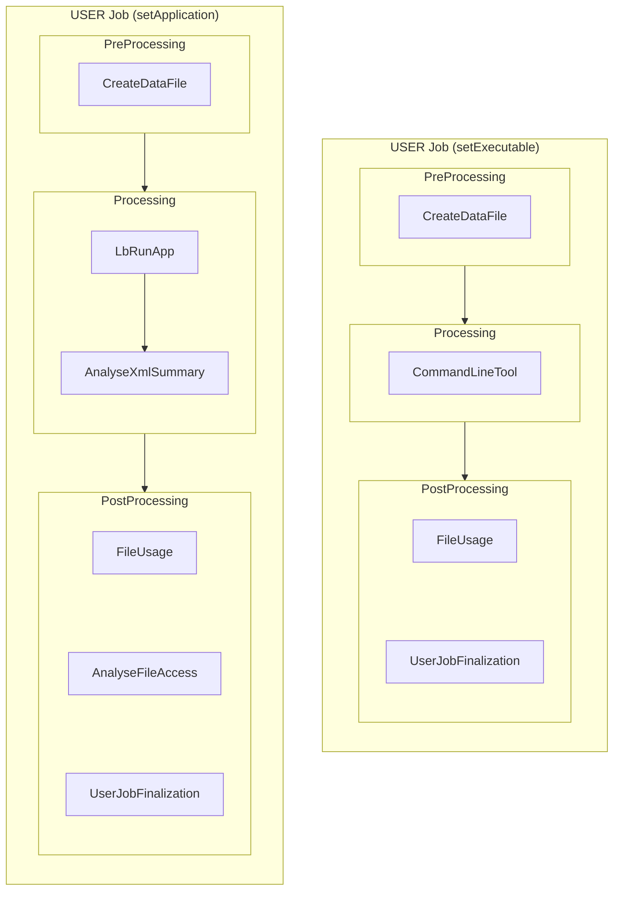
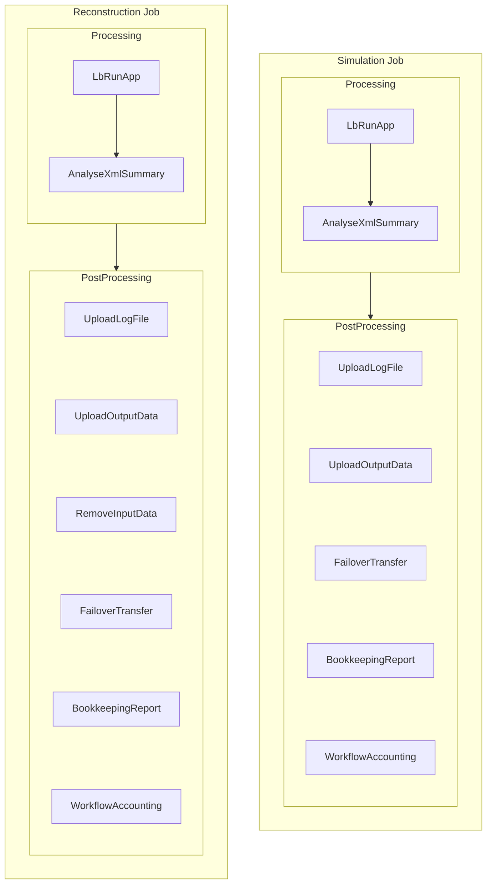

# LHCb Workflow Commands

## Types of workflows

The commands are not in sequence as they can be executed in any order because they don't depend on any other's outputs.
If this wasn't the case, that should be taken into account and ensure they are set in the required arrangement.

## Relations between commands and DIRAC Components

```mermaid
---
title: Dirac-CWL commands
config:
    flowchart:
        defaultRenderer: "elk"
        curve: linear
---
flowchart LR
    %% ====================== 
    %% DataManager
    %% ====================== 

    getDestinationSEList{{**getDestinationSEList**}}
    getDestinationSEList getDestinationSEList_l@===> DataManager
    getFileDescenents{{"**getFileDescenents (lhcb)**"}}
    getFileDescenents getFileDescenents_l@===> DataManager
    DataManager[**DataManager**]

    classDef DataManagerLink stroke:#A31E00
    classDef DataManagerNode fill:#FF542E,stroke:#A31E00,stroke-width:4px ;
    class DataManager,getDestinationSEList,getFileDescenents DataManagerNode
    class getDestinationSEList_l,getFileDescenents_l DataManagerLink

    %% ====================== 
    %% OpsHelper
    %% ====================== 

    getValue{{**getValue**}}
    getValue getValue_opsHelper_l@===> OpsHelper
    OpsHelper[**OpsHelper**]

    classDef OpsHelperLink stroke:#A35F00
    classDef OpsHelperNode fill:#FFA82E,stroke:#A35F00,stroke-width:4px ;
    class getValue,OpsHelper OpsHelperNode
    class getValue_opsHelper_l OpsHelperLink
    
    %% ====================== 
    %% StorageElement
    %% ====================== 

    getUrl{{**getUrl**}}
    getUrl getUrl_l@===> StorageElement
    putFile{{**putFile**}}
    putFile putFile_l@===> StorageElement
    StorageElement[**StorageElement**]

    classDef StorageElementLink stroke:#E6C300 ;
    classDef StorageElementNode fill:#FFFC2E,stroke:#E6C300,stroke-width:4px ;
    class getUrl,putFile,StorageElement StorageElementNode
    class getUrl_l,putFile_l StorageElementLink

    %% ====================== 
    %% DataStoreClient
    %% ====================== 

    addRegister{{**addRegister**}}
    addRegister addRegister_l@===> DataStoreClient
    DataStoreClient[**DataStoreClient**]

    classDef DataStoreClientLink stroke:#75A300 ;
    classDef DataStoreClientNode fill:#C4FF2E,stroke:#75A300,stroke-width:4px ;
    class addRegister,DataStoreClient DataStoreClientNode
    class addRegister_l DataStoreClientLink

    %% ====================== 
    %% FailverTransfer
    %% ====================== 

    transferAndRegisterFile{{**transferAndRegisterFile**}}
    transferAndRegisterFile transferAndRegisterFile_l@===> FailoverTransfer
    setFileReplicationRequest{{**_setFileReplicationRequest**}}
    setFileReplicationRequest setFileReplicationRequest_l@===> FailoverTransfer
    FailoverTransfer[**FailoverTransfer**]
    
    classDef FailoverTransferLink stroke:#3CA300 ;
    classDef FailoverTransferNode fill:#7BFF2E,stroke:#3CA300,stroke-width:4px ;
    class transferAndRegisterFile,setFileReplicationRequest,FailoverTransfer FailoverTransferNode
    class transferAndRegisterFile_l,setFileReplicationRequest_l FailoverTransferLink

    %% ====================== 
    %% JobReport
    %% ====================== 

    setJobParameter{{**setJobParameter**}}
    setJobParameter setJobParameter_l@===> JobReport
    setApplicationStatus{{**setApplicationStatus**}}
    setApplicationStatus setApplicationStatus_l@===> JobReport
    JobReport[**JobReport**]

    classDef JobReportLink stroke:#00A354 ;
    classDef JobReportNode fill:#2EFF9A,stroke:#00A354,stroke-width:4px ;
    class setJobParameter,setApplicationStatus,JobReport JobReportNode
    class setJobParameter_l,setApplicationStatus_l JobReportLink

    %% ====================== 
    %% BookkeepingClient
    %% ====================== 

    getFileMetadata{{**getFileMetadata**}}
    getFileMetadata getFileMetadata_l@===> BookkeepingClient
    sendXMLBookkeepingReport{{**sendXMLBookkeepingReport**}}
    sendXMLBookkeepingReport sendXMLBookkeepingReport_l@===> BookkeepingClient
    getFileTypes{{"**getFileTypes (lhcb)**"}}
    getFileTypes getFileTypes_l@===> BookkeepingClient
    BookkeepingClient[**BookkeepingClient**]

    classDef BookkeepingClientLink stroke:#00A383 ;
    classDef BookkeepingClientNode fill:#2EFFD5,stroke:#00A383,stroke-width:4px ;
    class getFileMetadata,sendXMLBookkeepingReport,getFileTypes,BookkeepingClient BookkeepingClientNode
    class getFileMetadata_l,sendXMLBookkeepingReport_l,getFileTypes_l BookkeepingClientLink

    %% ====================== 
    %% FileReport
    %% ====================== 

    getFiles{{**getFiles**}}
    getFiles getFiles_l@===> FileReport
    setFileStatus{{**setFileStatus**}}
    setFileStatus setFileStatus_l@===> FileReport
    commit{{**commit**}}
    commit commit_l@===> FileReport
    generateForwardDISET{{**generateForwardDISET**}}
    generateForwardDISET generateForwardDISET_l@===> FileReport
    FileReport[**FileReport**]

    classDef FileReportLink stroke:#006AA3 ;
    classDef FileReportNode fill:#2EB6FF,stroke:#006AA3,stroke-width:4px ;
    class getFiles,setFileStatus,commit,generateForwardDISET,FileReport FileReportNode
    class getFiles_l,setFileStatus_l,commit_l,generateForwardDISET_l FileReportLink

    %% ====================== 
    %% ConfigurationSystem
    %% ====================== 

    getValueGconf{{**getValue**}}
    getValueGconf getValue_Gconf_l@===> ConfigurationSystem
    ConfigurationSystem[**ConfigurationSystem**]

    classDef ConfigurationSystemLink stroke:#0034A3 ;
    classDef ConfigurationSystemNode fill:#5C8FFF,stroke:#0034A3,stroke-width:4px ;
    class getValueGconf,ConfigurationSystem ConfigurationSystemNode
    class getValue_Gconf_l ConfigurationSystemLink

    %% ====================== 
    %% FileCatalog
    %% ====================== 

    addFile{{**addFile**}}
    addFile addFile_l@===> FileCatalog
    FileCatalog[**FileCatalog**]

    classDef FileCatalogLink stroke:#4400A3 ;
    classDef FileCatalogNode fill:#A05CFF,stroke:#4400A3,stroke-width:4px ;
    class addFile,FileCatalog FileCatalogNode
    class addFile_l FileCatalogLink

    %% ======================
    %% Commands
    %% ======================
    
    UploadLogFile("UploadLogFile")
    
    UploadLogFile UploadLogFile_l1@===> getDestinationSEList
    UploadLogFile UploadLogFile_l2@===> getValue
    UploadLogFile UploadLogFile_l3@===> getUrl
    UploadLogFile UploadLogFile_l4@===> putFile
    UploadLogFile UploadLogFile_l5@===> transferAndRegisterFile
    UploadLogFile UploadLogFile_l6@===> setJobParameter
    UploadLogFile UploadLogFile_l7@===> setApplicationStatus
    UploadLogFile UploadLogFile_l8@===> getFileTypes

    class UploadLogFile_l1 DataManagerLink
    class UploadLogFile_l2 OpsHelperLink
    class UploadLogFile_l3,UploadLogFile_l4 StorageElementLink
    class UploadLogFile_l5 FailoverTransferLink
    class UploadLogFile_l6,UploadLogFile_l7 JobReportLink
    class UploadLogFile_l8 BookkeepingClientLink

    %% ======================

    UploadOutputData("UploadOutputData")

    UploadOutputData UploadOutputData_l1@===> transferAndRegisterFile
    UploadOutputData UploadOutputData_l2@===> setJobParameter
    UploadOutputData UploadOutputData_l3@===> setApplicationStatus
    UploadOutputData UploadOutputData_l4@===> sendXMLBookkeepingReport
    UploadOutputData UploadOutputData_l5@===> addFile

    class UploadOutputData_l1 FailoverTransferLink
    class UploadOutputData_l2,UploadOutputData_l3 JobReportLink
    class UploadOutputData_l4 BookkeepingClientLink
    class UploadOutputData_l5 FileCatalogLink

    %% ======================

    RemoveInputData("RemoveInputData")

    RemoveInputData RemoveInputData_l1@===> getFileDescenents
    RemoveInputData RemoveInputData_l2@===> setApplicationStatus

    class RemoveInputData_l1 DataManagerLink
    class RemoveInputData_l2 JobReportLink

    %% ======================

    FailoverTransferC("FailoverTransfer")
        
    FailoverTransferC FailoverTransferC_l1@===> getFiles
    FailoverTransferC FailoverTransferC_l2@===> setFileStatus
    FailoverTransferC FailoverTransferC_l3@===> generateForwardDISET
    FailoverTransferC FailoverTransferC_l4@===> commit

    class FailoverTransferC_l1,FailoverTransferC_l2,FailoverTransferC_l3,FailoverTransferC_l4 FileReportLink

    %% ======================

    BookkeepingReport("BookkeepingReport")

    BookkeepingReport BookkeepingReport_l1@===> setApplicationStatus
    BookkeepingReport BookkeepingReport_l2@===> getFileMetadata
    BookkeepingReport BookkeepingReport_l3@===> getValueGconf

    class BookkeepingReport_l1,BookkeepingReport_l2 JobReportLink
    class BookkeepingReport_l3 ConfigurationSystemLink

    %% ======================

    WorklflowAccounting("WorklflowAccounting
    (StepAccounting)")

    WorklflowAccounting WorklflowAccounting_l1@===> addRegister
    WorklflowAccounting WorklflowAccounting_l2@===> getValueGconf
    class WorklflowAccounting_l1 DataStoreClientLink
    class WorklflowAccounting_l2 ConfigurationSystemLink

    %% ======================

    AnaliseFileAccess("AnaliseFileAccess")

    UserJobFinalization("UserJobFinalization")

    UserJobFinalization UserJobFinalization_l1@===> transferAndRegisterFile
    UserJobFinalization UserJobFinalization_l2@===> setFileReplicationRequest
    UserJobFinalization UserJobFinalization_l3@===> setJobParameter
    UserJobFinalization UserJobFinalization_l4@===> setApplicationStatus
    
    class UserJobFinalization_l1,UserJobFinalization_l2 FailoverTransferLink
    class UserJobFinalization_l3,UserJobFinalization_l4 JobReportLink

    %% ======================

    FileUsage("FileUsage")
    
    FileUsage FileUsage_l1@===> getValueGconf
    class FileUsage_l1 ConfigurationSystemLink
```

## Command's inputs & outputs

| Command | Consumes | Creates | Requires |
| --- | --- | --- | --- |
| CreateDataFile | Inputs | data.py | poolXMLCatName |
| UploadLogFile | Outputs | N/A | JobID ProductionID Namespace ConfigVersion |
| UploadOutputData | Outputs Inputs XMLSummary.xml | N/A | OutputDataStep OutputList OutputMode ProductionOutputData SiteName |
| RemoveInputData | Inputs | N/A | N/A |
| FailoverTransfer | Inputs | request.json | N/A |
| BookkeepingReport | Outputs | bookkeeping.xml | StepID ApplicationName ApplicationVersion StartTime ProductionId StepNumber SiteName JobType |
| WorkflowAccounting | N/A | N/A | RunNumber ProdID EventType SiteName ProcessingStep CpuTime NormCpuTime InputsStats OutputStats InputEvents OutputEvents EventTime NProcs JobGroup FinalState |
| AnalyseFileAccess | XMLSummary.xml pool_xml_catalog.xml | N/A | N/A |
| UserJobFinalization | UserOutputData | bookkeeping.xml | JobId UserOutputSE SiteName UserOutputPath ReplicateUserOutData UserOutputLFNPrep |

**Legend:**

- **Consumes**: Files that will be processed
- **Creates**: Files that generates
- **Requires**: Extra information required from the parameters or DIRAC
