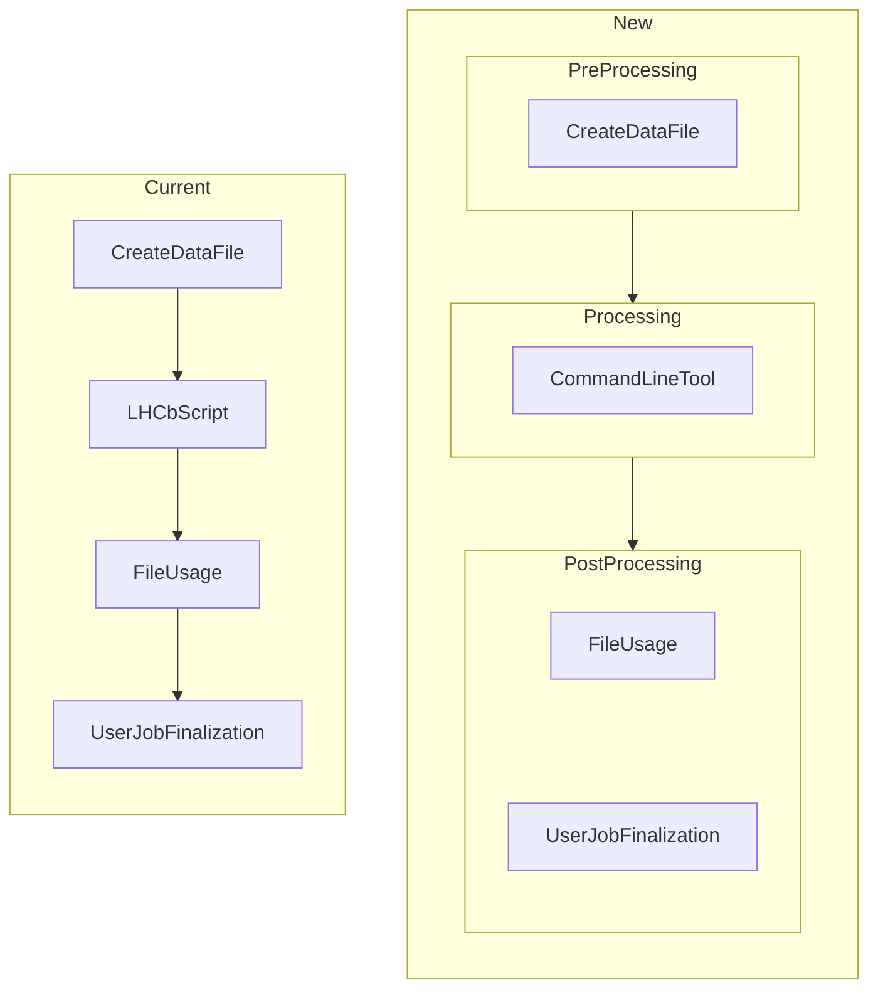
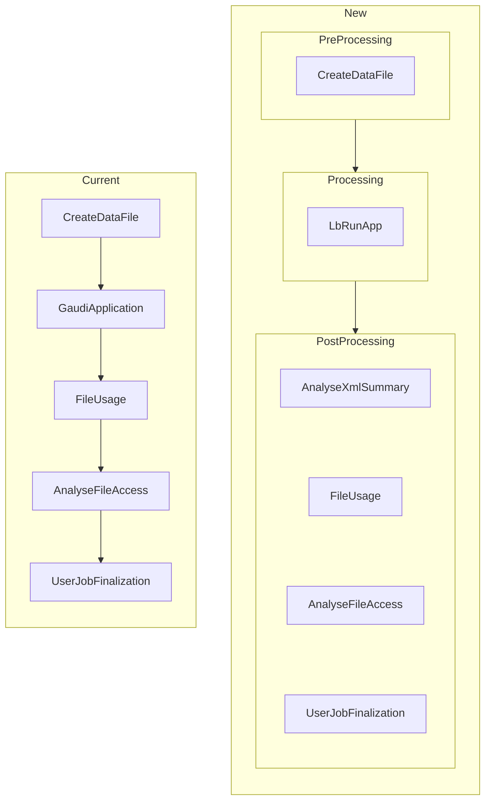
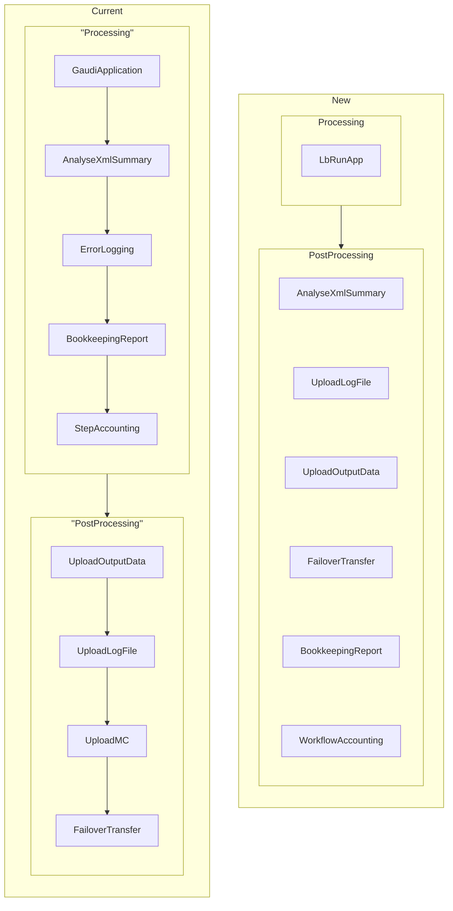
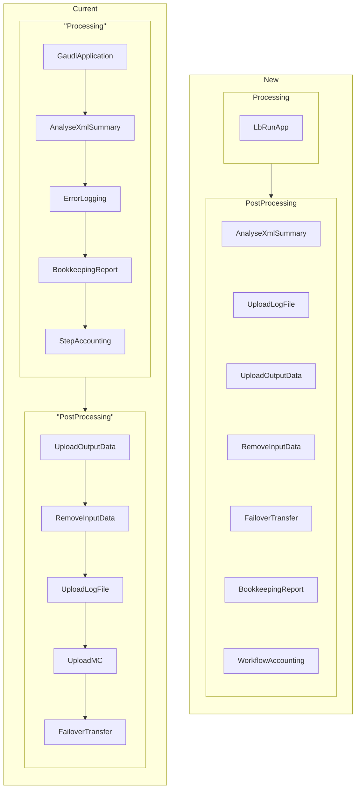

# LHCb Workflow Commands

## Types of workflows

Currently, the Workflow Modules execute in a predefined order.

For the new approach with CWL, the modules are called "commands" and can be executed in any order, because they don't depend on any other's outputs. However, an order has to be defined while defining the `JobType`, which can be the same as the current order.

### USER Job (setExecutable)

### USER Job (setApplication)

### Simulation Job

For this type of job and for the following one (Reconstruction), currently we have some kind of processing and a post-processing step. The main difference with the new approach is that the processing step also contained modules and as this step could be executed multiple times, so did those modules.

Now, as we moved those commands out of the processing step, the commands that used to execute multiple times, now they need to deal with multiple outputs at a time, as they only execute once.

### Reconstruction Job

## Relations between commands and DIRAC Components

## Command's inputs & outputs

Some commands have been removed, such as `UploadMC` or `ErrorLogging`, so they won't appear in this table.

| Command | Consumes | Creates | Requires |
| --- | --- | --- | --- |
| CreateDataFile | Inputs | data.py | poolXMLCatName |
| UploadLogFile | Outputs | N/A | JobID ProductionID Namespace ConfigVersion |
| UploadOutputData | Outputs Inputs XMLSummary.xml | N/A | OutputDataStep OutputList OutputMode ProductionOutputData SiteName |
| RemoveInputData | Inputs | N/A | N/A |
| FailoverTransfer | Inputs | request.json | N/A |
| BookkeepingReport | Outputs | bookkeeping.xml | StepID ApplicationName ApplicationVersion StartTime ProductionId StepNumber SiteName JobType |
| WorkflowAccounting | N/A | N/A | RunNumber ProdID EventType SiteName ProcessingStep CpuTime NormCpuTime InputsStats OutputStats InputEvents OutputEvents EventTime NProcs JobGroup FinalState |
| AnalyseFileAccess | XMLSummary.xml pool_xml_catalog.xml | N/A | N/A |
| UserJobFinalization | UserOutputData | bookkeeping.xml | JobId UserOutputSE SiteName UserOutputPath ReplicateUserOutData UserOutputLFNPrep |

**Legend:**

- **Consumes**: Files that will be processed
- **Creates**: Files that generates
- **Requires**: Extra information required from the parameters or DIRAC

### CreateDataFile

Creates a `data.py` data file from the inputs to be used by Ganga.

### AnalyseXMLSummary

Performs a series of checks on the XMLSummary output to make sure the execution was done correctly.

### BookkeepingReport

Generates a bookkeeping report file based on the XMLSummary and the pool XML catalog.

### WorkflowAccounting

Prepare and send accounting information to the DIRAC Accounting system.

### FileUsage

Report file usage to a DataFileUsage service.

### UploadOutputData

Registers every output generated to the corresponding SE and to the Master Catalog or to the FailoverSE in case of failure.

### FailoverTransfer

Commits the status of the files in the file report. The status will be "Processed" if everything ended properly or "Unused" if it did not.

### UploadLogFile

Uploads a compressed list of outputs to a DIRAC LogSE.

### RemoveInputData

Removes the inputs and their replicas (if any) from every SE and File Catalog.

### AnalyseFileAccess

Uses the XMLCatalog and XMLSummary to check if the access of each input file was successful or not.
