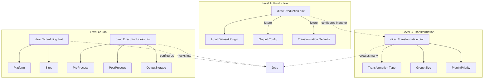
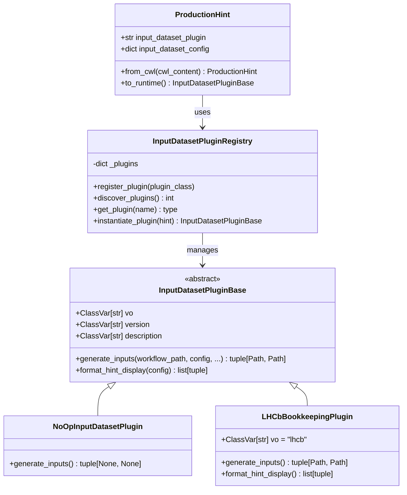
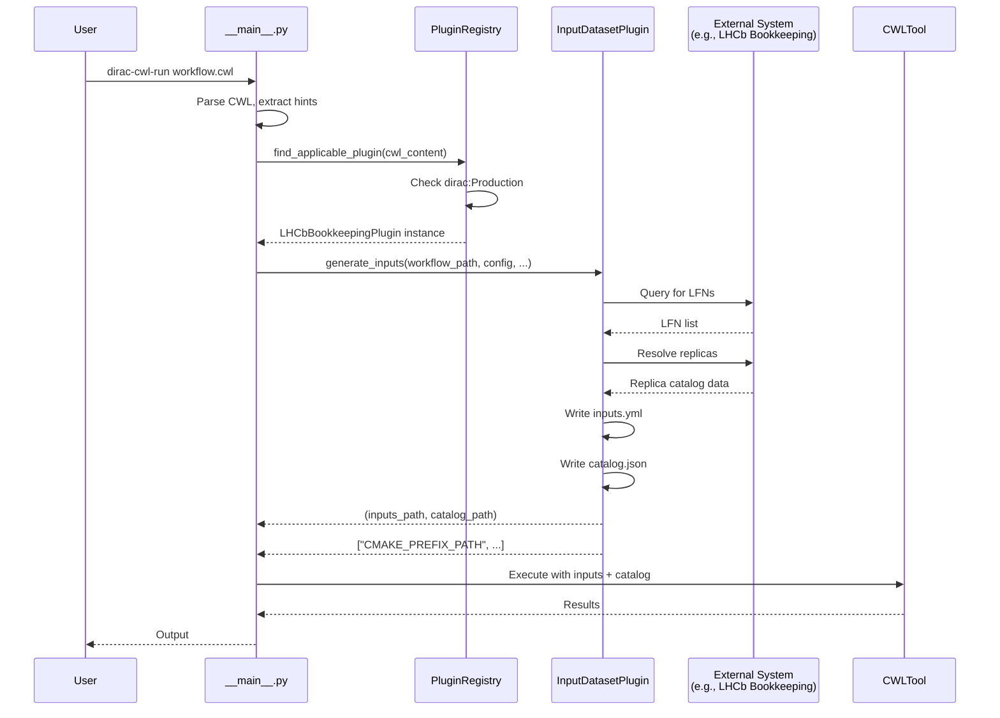

# Production Plugin System Design

## Overview

This document describes the design for a pluggable Production configuration system that makes the CWL executor (`__main__.py`) completely generic by extracting experiment-specific code (e.g., LHCb Bookkeeping integration) into plugins.

## Three-Level CWL Submission Model



| Level | DIRAC Concept | CWL Scope | Hint |
|-------|---------------|-----------|------|
| **(a) Production** | Production/Request | Orchestrates transformations, configures input data | `dirac:Production` |
| **(b) Transformation** | Transformation | Job template - defines steps that run in each job | `dirac:Transformation` |
| **(c) Job** | Job | Single execution with specific inputs | `dirac:Scheduling`, `dirac:ExecutionHooks` |

**Key insight:** A Transformation workflow is a **job template**. DIRAC creates many jobs from it, each with different input files.

## Plugin Architecture



## CWL Hint Formats

### New Format: `dirac:Production`

```yaml
cwlVersion: v1.2
class: Workflow

hints:
  - class: dirac:Production
    input_dataset_plugin: "LHCbBookkeepingPlugin"
    input_dataset_config:
      event_type: "27165175"
      conditions_description: "Beam6800GeV-VeloClosed-MagUp-Excl-UT"
      conditions_dict:
        configName: "Collision24"
        configVersion: "Beam6800GeV-VeloClosed-MagUp-Excl-UT"
        inFileType: "BRUNELHLT2.DST"
        inProPass: "Sprucing24c5/DaVinciRestripping25r0"
```

## Data Flow



## File Structure

```
dirac-cwl/src/dirac_cwl/
├── production/
│   ├── __init__.py              # Package init + auto-discovery
│   ├── core.py                  # ProductionHint + InputDatasetPluginBase
│   ├── registry.py              # InputDatasetPluginRegistry
│   └── plugins/
│       ├── __init__.py          # Plugin exports
│       ├── core.py              # NoOpInputDatasetPlugin
│       └── lhcb.py              # LHCbBookkeepingPlugin (temporary)
├── job/
│   └── executor/
│       └── __main__.py          # Modified to use plugin system
└── ...
```

## Entry Points Configuration

In `pyproject.toml`:

```toml
[project.entry-points."dirac_cwl.input_dataset_plugins"]
NoOpInputDatasetPlugin = "dirac_cwl.production.plugins:NoOpInputDatasetPlugin"
LHCbBookkeepingPlugin = "dirac_cwl.production.plugins.lhcb:LHCbBookkeepingPlugin"
```

**Done so far (DIRACGrid/dirac-cwl#94):**
- `dirac:Production` hint with `input_dataset_plugin` for querying external catalogs
- Plugin generates `inputs.yml` + `catalog.json` for local CWL execution

**Future work (CWL submission tools):**
The following will be **configured via CWL hints** when we build the submission CLI, but are **executed by DIRAC agents** at runtime:

| Feature | CWL Hint | DIRAC Agent | Notes |
|---------|----------|-------------|-------|
| Transformation grouping | `dirac:Transformation` (plugin, groupSize) | TransformationAgent | Groups files into tasks |
| Input Meta Queries | `dirac:Transformation` (inputQuery) | InputDataAgent | Finds input files from upstream |
| Output registration | `dirac:ExecutionHooks` or similar | Job wrapper | Registers outputs to catalog |

The hints define **what** should happen; DIRAC agents execute **when** and **how**.
